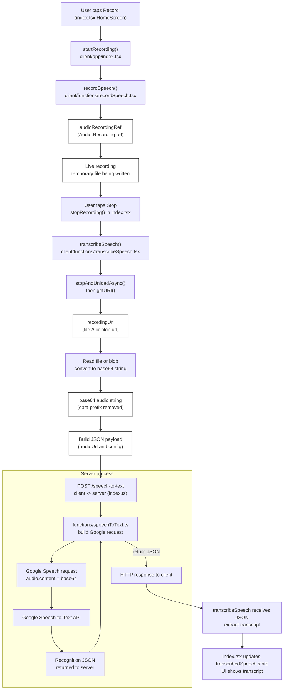

# Speech-to-Text (STT) Process — System Trace

This document traces the complete speech-to-text flow in this repository, showing every call site and the state of the audio data as it moves from the UI to Google Speech-to-Text and back. It includes a Mermaid diagram, a component catalog, integration details, and short recommendations.

## Mermaid Diagram — user flow focused STT

## Step-by-step trace (with exact call sites)

1. User presses the record button in `client/app/index.tsx` (HomeScreen). The `TouchableOpacity` `onPress` calls `toggleRecording()` which calls either `startRecording()` or `stopRecording()` depending on `isRecording` state.

2. `startRecording()` (in `client/app/index.tsx`) does:
   - `setIsRecording(true)`
   - `await recordSpeech(audioRecordingRef, setIsRecording, Boolean(webAudioPermissionsRef.current))`

3. `recordSpeech()` (`client/functions/recordSpeech.tsx`):
   - Prepares `Audio` mode via `Audio.setAudioModeAsync(...)`.
   - Requests permissions (native path via `Audio.requestPermissionsAsync()` or reuses a web MediaStream if provided).
   - If necessary, creates a new `Audio.Recording()` and `prepareToRecordAsync(recordingOptions)` with platform-specific options.
   - `startAsync()` begins the live recording. The function leaves `audioRecordingRef.current` set to the Expo `Audio.Recording` instance.
   - Data state: "Live recording" — the recording writes to a temporary file but there is no final URI until stopped and unloaded.

4. While the user records, `audioRecordingRef.current` is the active `Audio.Recording`. After the user taps the button again, `toggleRecording()` calls `stopRecording()`.

5. `stopRecording()` (client/app/index.tsx):
   - `setIsRecording(false)`
   - `setIsTranscribing(true)`
   - `const speechTranscript = await transcribeSpeech(audioRecordingRef)`

6. `transcribeSpeech()` (`client/functions/transcribeSpeech.tsx`):
   - Calls `await audioRecordingRef.current.stopAndUnloadAsync()` to finalize the recording and ensure the file is written.
   - Calls `audioRecordingRef.current.getURI()` to retrieve a `recordingUri` (string). On native: `file://` URI. On web: a `blob:` or data URL.
   - If `Platform.OS === 'web'`: fetch the `recordingUri` and convert the Blob into a base64 string using `readBlobAsBase64(blob)` and strip the `data:...base64,` prefix.
   - Else (native): use `readAsStringAsync(recordingUri, { encoding: EncodingType.Base64 })` from `expo-file-system` to read the file as base64.
   - The function constructs `audioConfig` (encoding, sampleRateHertz, languageCode, alternativeLanguageCodes).
   - If `recordingUri` and `dataUrl` exist, `transcribeSpeech()` does an HTTP POST to `http://<rootOrigin>:4000/speech-to-text` with body `JSON.stringify({ audioUrl: dataUrl, config: audioConfig })`.
   - response JSON is returned to the caller (the function extracts `results[0].alternatives[0].transcript` and returns the transcript string to `stopRecording()`.)

7. `stopRecording()` receives the `speechTranscript` and appends it to `transcribedSpeech` state.

8. On the server side, `index.ts` receives POST `/speech-to-text` and the handler is in `functions/speechToText.ts` which:
   - reads `req.body.audioUrl` (expected plain base64 string) and `req.body.config`.
   - builds a Google Speech `request` object including `audio: { content: audioBase64 }` and `config` (encoding, sampleRate, language, etc.).
   - calls `client.recognize(request)` on `@google-cloud/speech` (v1p1beta1.SpeechClient).
   - returns Google’s recognize response to the client as JSON.

9. Client receives the response and displays the transcript.

## Component catalog (STT-relevant)

- HomeScreen (client/app/index.tsx)
  - Tech: React Native + Expo
  - Responsibility: UI controls for recording/translating and orchestrates record/transcribe/translate calls
  - Key files: `client/app/index.tsx`
  - Heavy logic: state management and orchestration of sequencing recording → transcribing → translating.

- Recorder helper (client/functions/recordSpeech.tsx)
  - Tech: Expo Audio
  - Responsibility: prepare and start audio recording using platform-specific options
  - Key files: `client/functions/recordSpeech.tsx`
  - Heavy logic: permission handling, recordingOptions, start/stop lifecycle

- Transcriber (client/functions/transcribeSpeech.tsx)
  - Tech: Expo FileSystem + fetch (web) + Audio
  - Responsibility: finalize the recording, convert to base64, POST to server `/speech-to-text`
  - Key files: `client/functions/transcribeSpeech.tsx`, `client/functions/readBlobAsBase64.tsx`
  - Heavy logic: platform branching for reading audio, building payload, handling size/payload limits

- Server router (index.ts)
  - Tech: Node.js, Express
  - Responsibility: expose POST `/speech-to-text`, parse JSON body, forward to speechToText handler
  - Key files: `index.ts`
  - Heavy logic: routing, CORS, body-size config

- Google Speech handler (functions/speechToText.ts)
  - Tech: Node.js, @google-cloud/speech
  - Responsibility: accept base64 audio, construct Google request, call Google Speech API and return results
  - Key files: `functions/speechToText.ts`
  - Heavy logic: building the Speech API request, error handling, credentials

## Integration points & data formats

- Client → Server
  - Protocol: HTTP POST
  - Endpoint: `http://<dev-host>:4000/speech-to-text`
  - Content-Type: `application/json`
  - Body: `{ audioUrl: "<base64 string>", config: { encoding, sampleRateHertz, languageCode } }`
  - Sync vs Async: synchronous HTTP request; client awaits the response

- Server → Google
  - Protocol: gRPC/HTTP via `@google-cloud/speech` client
  - Data format: Google Speech request with `audio.content` (base64) and `config` object
  - Sync vs Async: server-call awaits Google response, then returns JSON to the client

## Where to start (if you want to follow the code)

- UI flow: `client/app/index.tsx` — see `startRecording()`, `stopRecording()` and how they call helpers.
- Recording: `client/functions/recordSpeech.tsx` — platform recording options and start/stop logic.
- Transcription: `client/functions/transcribeSpeech.tsx` — exact conversion from URI/Blob → base64 and POST to server.
- Server wiring: `index.ts` — routes and CORS/body settings.
- Google call: `functions/speechToText.ts` — how the request is built and how credentials are used.

## Notes, caveats, and recommended improvements

- Large payloads: base64 in JSON can grow large. Consider uploading the file to cloud storage (GCS) and sending an object URL to the server, or use streaming uploads.
- Encoding mismatch: ensure `audioConfig.encoding` and `sampleRateHertz` match the actual recording options to avoid poor recognition.
- Error handling: transcribeSpeech swallows some errors; consider surfacing network or server errors to the UI.
- Web path: the web MIME type and sample rates differ (web uses `WEBM_OPUS`/48000) — ensure server `speechToText.ts` maps these to Google-friendly encodings or uses a conversion step.
- Security: do not expose Google credentials to the client. Keep `functions/speechToText.ts` server-side.

## Completion checklist

- [x] Mermaid diagram with all call sites
- [x] Step-by-step trace with data-state labels
- [x] Component catalog and integration points
- [x] Recommendations and next steps

---

If you'd like I can:
- Commit this file to the repository (it's already created at the project root as `STT_process.md`).
- Create a visual PNG render of the Mermaid diagram.
- Update `speechToText.ts` to accept client-supplied languageCode dynamically.

Which next step would you like?