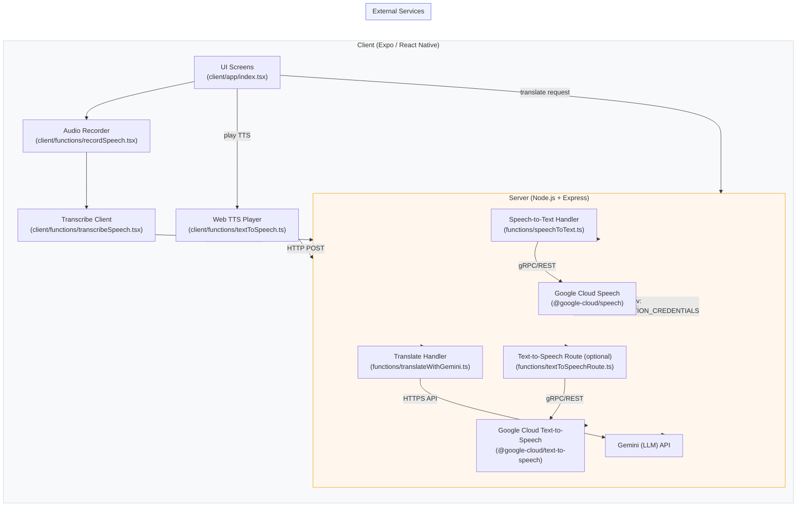

# Switchy Speech — System Overview

This document provides a high-level system architecture for the Switchy Speech project: major components, how they integrate, and where to start as a new contributor.

## 1) System Overview Diagram (Mermaid)

Notes:
- The client performs audio capture and sends base64-encoded audio to the server.
- The server is a thin API layer that maps requests into heavyweight external services (Google Speech for STT, Gemini for translation, Google TTS for optional TTS).

## 2) Component Catalog

- Component Name: Client App (Expo / React Native)
  - Technology/Framework: React Native (Expo), TypeScript
  - Primary Responsibility: UI, audio capture, client-side orchestration, playback
  - Key Files: `client/app/index.tsx`, `client/functions/recordSpeech.tsx`, `client/functions/transcribeSpeech.tsx`
  - Heavy Logic: platform-specific audio recording and file handling, user-facing state transitions.

- Component Name: Transcribe Client
  - Technology: TypeScript (client)
  - Primary Responsibility: read recording into base64, build audio config, POST to `/speech-to-text`
  - Key Files: `client/functions/transcribeSpeech.tsx`
  - Heavy Logic: web vs mobile file reads, base64 normalization.

- Component Name: Web TTS Player
  - Technology: TypeScript (client), HTMLAudioElement
  - Primary Responsibility: request synthesized audio and play via data URI in browser
  - Key Files: `client/functions/textToSpeech.ts`
  - Heavy Logic: data URI management, playback lifecycle.

- Component Name: API Server (Express)
  - Technology/Framework: Node.js, Express, TypeScript
  - Primary Responsibility: route requests, validate, orchestrate external calls
  - Key Files: `index.ts`, `functions/speechToText.ts`, `functions/translateWithGemini.ts`
  - Heavy Logic: map client payloads to service SDKs/APIs, error handling, credentials management.

- Component Name: Speech-to-Text Handler
  - Technology: `@google-cloud/speech` (v1p1beta1)
  - Primary Responsibility: call Google Speech `recognize()` with proper config and return results
  - Key Files: `functions/speechToText.ts`
  - Heavy Logic: building `config` (encoding, rates, languages), parsing `recognize` results.

- Component Name: Gemini Translator
  - Technology: Node.js HTTP client / SDK wrapper
  - Primary Responsibility: send text to Gemini, receive translations, format for client
  - Key Files: `functions/translateWithGemini.ts`, `functions/geminiClient.ts`
  - Heavy Logic: prompt engineering, result parsing, retry/backoff logic.

- Component Name: Text-to-Speech Handler (optional)
  - Technology: `@google-cloud/text-to-speech` (optional)
  - Primary Responsibility: synthesize text to audio and return base64 audioContent
  - Key Files: `functions/textToSpeechRoute.ts`
  - Heavy Logic: choose audio encoding, voice/SSML handling, base64 encoding of binary.

- Component Name: Local Dev & Tooling
  - Technology: macOS, Xcode (simulator), Expo CLI
  - Primary Responsibility: local runtime, simulator management, env handling
  - Key Files: `package.json` scripts, `.env` (recommended)

## 3) Technology Stack (Quick Reference)

- UI Layer: React Native (Expo), React
- State / Logic: React hooks, TypeScript helper modules
- API Layer: Node.js + Express (TypeScript)
- Data Layer: none (no persistent DB)
- External Dependencies: Google Cloud Speech, Google Cloud TTS (optional), Gemini API, Expo SDK (`expo-av`, `expo-file-system`)

## 4) Integration Points

- Client ↔ Server
  - Protocol: HTTP POST (JSON)
  - Data format: JSON; audio is base64 string in `audioUrl`.
  - Mode: synchronous request/response.

- Server ↔ Google Cloud (Speech / TTS)
  - Protocol: gRPC/REST via `@google-cloud/*` SDKs
  - Data format: SDK objects with `audio.content` base64 for STT; TTS returns binary audio which is base64-encoded for client.
  - Mode: synchronous (server awaits SDK call)

- Server ↔ Gemini
  - Protocol: HTTPS JSON API
  - Mode: synchronous in current flow; consider async jobs for heavy/long translations.

## 5) Where to Start (recommended reading order)

- User interactions & UI lifecycle: `client/app/index.tsx`
- Recording flow: `client/functions/recordSpeech.tsx`
- File reading & STT client call: `client/functions/transcribeSpeech.tsx`
- Server routing & STT handler: `index.ts`, `functions/speechToText.ts`
- LLM translation: `functions/translateWithGemini.ts`, `functions/geminiClient.ts`
- Web TTS playback: `client/functions/textToSpeech.ts` (enable `functions/textToSpeechRoute.ts` on server if you need server TTS)

## Next steps & suggestions

- If you want this committed to the repository, open a PR with this file: `switchy_system_overview.md`.
- I can also generate a PNG/SVG of the Mermaid diagram or insert this into a developer onboarding doc.
- Optionally expand the catalog into a contributor checklist that maps common changes (change default language, enable TTS, adjust sample rate) to the exact files to edit.

---

File created: `switchy_system_overview.md`

If you want, I will commit this file to the repo directly or generate an image of the Mermaid diagram next.